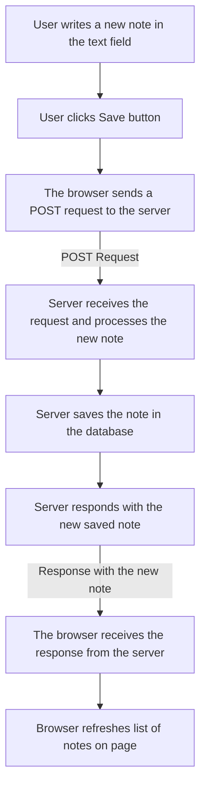
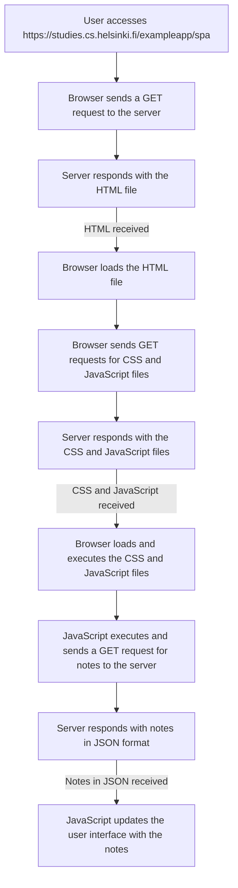
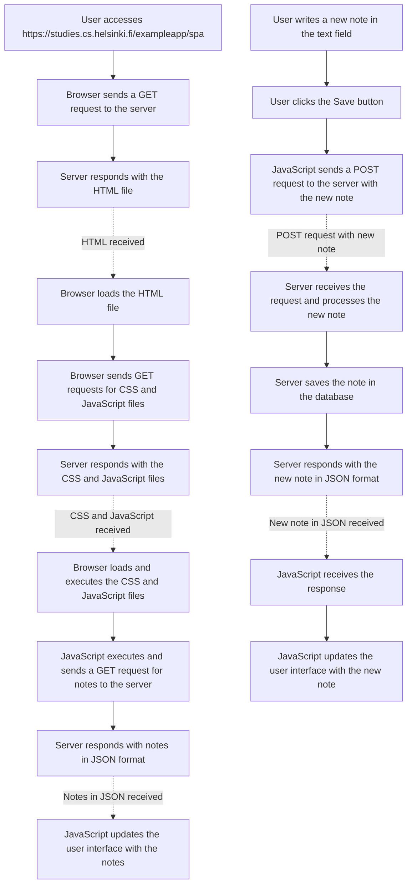

<h1 align="center">
New note diagram
</h1>

```mermaid
graph TD
    A[User writes a new note in the text field] --> B[User clicks Save button]
    B -->C[The browser sends a POST request to the server]
    C -->|POST Request| D[Server receives the request and processes the new note]
    D -->E[Server saves the note in the database]
    E -->F[Server responds with the new saved note]
    F -->|Response with the new note| G[The browser receives the response from the server]
    G -->H[Browser refreshes list of notes on page]
```

<h1 align="center">
Single page application diagram
</h1>

```mermaid
graph TD
    A[User accesses https://studies.cs.helsinki.fi/exampleapp/spa] --> B[Browser sends a GET request to the server]
    B --> C[Server responds with the HTML file]
    C -->|HTML received| D[Browser loads the HTML file]
    D --> E[Browser sends GET requests for CSS and JavaScript files]
    E --> F[Server responds with the CSS and JavaScript files]
    F -->|CSS and JavaScript received| G[Browser loads and executes the CSS and JavaScript files]
    G --> H[JavaScript executes and sends a GET request for notes to the server]
    H --> I[Server responds with notes in JSON format]
    I -->|Notes in JSON received| J[JavaScript updates the user interface with the notes]
```

<h1 align="center">
New note in single page application diagram
</h1>

```mermaid
graph TD
    %% Access to SPA
    A[User accesses https://studies.cs.helsinki.fi/exampleapp/spa] --> B[Browser sends a GET request to the server]
    B --> C[Server responds with the HTML file]
    C -.HTML received.-> D[Browser loads the HTML file]
    D --> E[Browser sends GET requests for CSS and JavaScript files]
    E --> F[Server responds with the CSS and JavaScript files]
    F -.CSS and JavaScript received.-> G[Browser loads and executes the CSS and JavaScript files]
    G --> H[JavaScript executes and sends a GET request for notes to the server]
    H --> I[Server responds with notes in JSON format]
    I -.Notes in JSON received.-> J[JavaScript updates the user interface with the notes]

    %% Create new note
    K[User writes a new note in the text field] --> L[User clicks the Save button]
    L --> M[JavaScript sends a POST request to the server with the new note]
    M -.POST request with new note.-> N[Server receives the request and processes the new note]
    N --> O[Server saves the note in the database]
    O --> P[Server responds with the new note in JSON format]
    P -.New note in JSON received.-> Q[JavaScript receives the response]
    Q --> R[JavaScript updates the user interface with the new note]
```